# Relatório LABDSOFT P2

## Introdução

O presente relatório foi desenvolvido no âmbito da unidade curricular de Laboratório Desenvolvimento Software (LABDSOFT) do Mestrado em Engenharia Informática (MEI) do Instituto Superior de Engenharia do Porto (ISEP).

No presente documento vão ser descritos o produto e as suas funcionalidades com suporte a diagramas desenvolvidos pela equipa. Para além disto serão descritas as decisões tomadas e as suas justificações, artefactos relevantes para o projeto, as medidas de qualidade usadas.

### Âmbito do projeto

O Centro de Inovação e do Transplante de Órgãos (CITO) é uma clínica caracterizada por gerir a atribuição de órgãos humanos entre possíveis recetores e possíveis dadores através de critérios complexos que envolvem por um lado análises genéticas (DNA), análises víricas, análises de imunidade, análises serológicas e, por outro lado, critérios de prioridade para os possíveis recetores, nomeadamente: a sua urgência, a idade, o tempo de espera, etc. 

A CITO pretende uma aplicação que automatize e simplifique os processos associados à sua atividade.

## Organização

O projeto foi feito em duas grandes etapas. A primeira esta relacionada com o planeamento do projeto. Nesta fase foi necessário avaliar os requisitos e planear os sprints. Numa segunda parta procedeu-se ao desenvolvimento propriamente dito. Para isso, usou-se todo o planeamento tanto de análise de requisitos como de design feito na primeira iteração.

## Processo de Análise e Organização dos Requisitos

Após a análise dos requisitos surgiram algumas dúvidas, às quais foram esclarecidas com o Product Owner. Após este processo foram distribuídos responsabilidades referente a cada requisito e foram anotados num documento Markdown.

[Distribuicao_de_Tarefas](Distribuicao_de_Tarefas.md)

Depois foram criadas User Stories mais pequenas a partir das tarefas distribuídas e o grupo escolheu usar o plug-in do Jira no Bitbucket para gerir o estado de cada User Story.

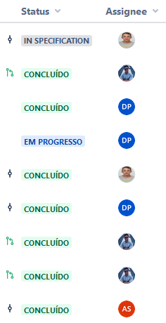

## Regras do Processo do Desenvolvimento

### Feature Branch

A principal branch para o desenvolvimento da aplicação é precisamente a **dev**, onde o código criado em cada feature é **merged**, e é sujeita a **pipeline runs** a cada **commit**, testando a sua capacidade de executar corretamente a app, a interface gráfica, a componente dedicada à integração da API de equipamentos e o scan de segurança.

Dado que esta se tratou da primeira iteração de desenvolvimento, a equipa negligenciou a utilização de uma **master branch**, comummente observada em projetos desta tipologia e estratégia, aspeto que será objeto de discussão entre os membros para uma potencial inclusão nas próximas iterações.

### Regras do projeto

De forma a poder garantir algum tipo de consistência dentro do processo de desenvolvimento e passagem das alterações para o branch principal foram estipulados um conjunto de nomenclaturas e regras para serem cumpridas por todos os elementos da equipa:

1. Através do Issue do Jira criar o branch para o User Story.
2. Todos os commits dados são dados para o branch criado.
3. Cada commit terão o seguinte formato: [Jira Issue] [Backend/Frontend/Documentação] DESCRIÇÃO DO PROBLEMA
4. Quando a User Story estiver completa fazer o Pull Request para o master
   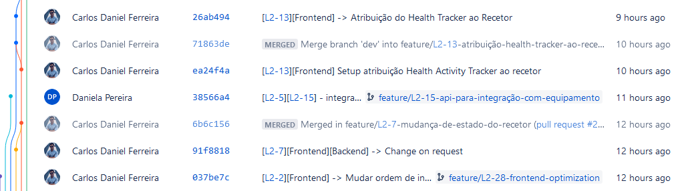

## Arquitetura

A solução implementada possui dois módulos distintos: um que grava a informação, obtém dados e realiza ações lógicas e de negócio, normalmente designado como Labdsoft Core, e outro que mostra a informação ao utilizador final e permite a interação do mesmo com os vários componentes, designado como LabdsoftUI.

### Arquitetura Onion

Após uma análise do problema, o grupo decidiu utilizar a Arquitetura Onion como solução. A Arquitetura Onion aborda os desafios das arquiteturas de 3 camadas ou mais, e fornece uma solução para problemas inerentes. As camadas da Arquitetura Onion interagem entre si através da utilização das Interfaces. A Arquitetura Onion é composta por múltiplas camadas concêntricas que interagem entre si em direção ao núcleo que representa o domínio. A arquitetura não depende da data layer, mas sim dos modelos de domínio. No centro da Arquitetura Onion está o Domain Layer, que representa os objetos de negócio. À volta da camada do Domain Layer encontram-se outras camadas, com outros comportamentos. A imagem seguinte é um exemplo da Arquitetura Onion:

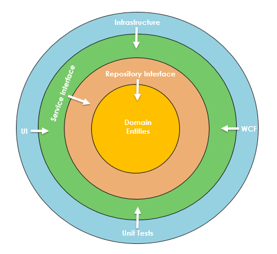

#### Domain Entities

No centro encontra-se o Domain Layer e é responsável por armazenar todos os objetos e as suas respetivas regras de negócio.

#### Repository Layer

Esta camada cria uma abstração entre as Domain Entities e as regras de negócio de uma aplicação. Nesta camada, acrescenta-se  tipicamente interfaces que proporcionam um comportamento de persistência de objetos, envolvendo uma base de dados. É criado um repositório genérico, e adiciona-se querys para obter os dados, mapear os dados, e persistir alterações na base de dados.

#### Service Layer

A Service Layer possui interfaces com operações comuns, tais como Add, Save, Edit, e Delete. Além disso, esta camada é utilizada para comunicar entre a UI Layer e a Repository Layer.

#### UI Layer

É a camada mais externa, e é responsável pelas preocupações periféricas como a IU e os testes. Para uma aplicação Web, representa o Web API ou Unit Test.

#### Abordagem  Arquitetural

Para esta solução foi utilizada a arquitetura Onion, e a imagem seguinte mostra as várias camadas do projeto desenvolvido:

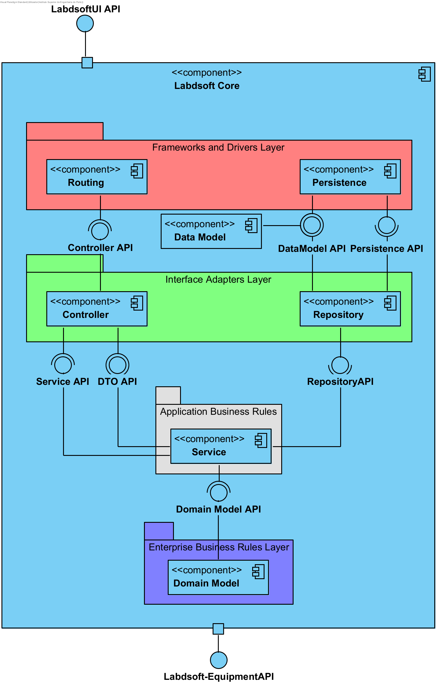

O componente Domain Model possuí as Entities. Existem Service Interfaces e Repositoy Interfaces que ligam as diferentes camadas. Há também o componente de base de dados que o grupo decidiu usar Postgre, uma vez que é uma base de dados relacional. O padrão DTO também foi utilizado para simplificar a entrada de dados no sistema. O componente controlador é responsável por receber pedidos CRUD (Create, Read, Update, Delete) do cliente.

### Padrão MVC

O MVC é um padrão de arquitetura de software. O MVC sugere uma  forma de dividir as responsabilidades, principalmente dentro de software web. O princípio  do MVC é a divisão da aplicação em três camadas: a camada de interação com o utilizador (**view**), a camada de manipulação dos dados (**model**) e a camada de controlo (**controller**). Com o MVC, é possível separar o código relativo à interface do utilizador das regras de negócio, o que sem dúvida traz muitas vantagens.

**Model** : A responsabilidade dos models é representar o negócio da aplicação. Também é responsável pelo acesso e manipulação dos dados da aplicação.

**View** : A view é responsável pela interface que será apresentada ao utilizador e mostra as informações do model para o utilizador.

**Controller**: É a camada de controlo, responsável por ligar o model e a view.

#### Abordagem  Arquitetural

Para esta solução foi utilizado padrão MVC, e a imagem seguinte mostra como foi desenvolvido no projeto:

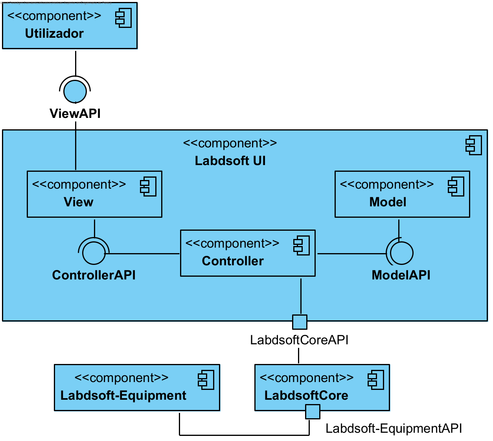

O utilizador interage com a UI através do componente View. O componente Model está responsável por manipular os dados que o utilizador prentende. O Controller é o intermediários entre estes dois componentes e está responsável por comunicar com o LabdsoftCore.

## **Tecnologias para Implementação**

### Modelo Relacional da Base de Dados

Na imagem seguinte está representado o modelo relacional da base de dados da solução.

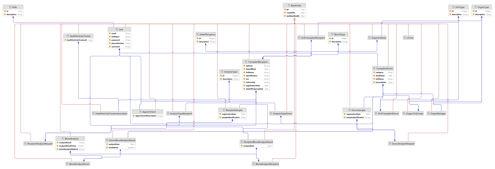

## Implementação

### Labdsoft Core

A aplicação foi desenvolvida utilizando Java, com recurso à **framework** Spring. A experiência dos membros da equipa com estas tecnologias ditou que seria ideal para os objetivos estabelecidos, reduzindo o tempo necessário para desenvolvimento. Para armazenamento de dados, a equipa decidiu optar por armazenamento local, recorrendo a PostgreSQL para gestão destes mesmo dados, e a Flyway para migrações (alterações à base dados).

### Labdsoft UI

Para a interface gráfica foi decidida a utilização do ambiente Node.js, com recurso à **framework** Angular e às linguagens HTML e TypeScript, sendo que mais uma vez a experiência dos constituintes da equipa com estas tecnologias influenciou consideravelmente a escolha. Acreditamos que a utilização de outras técnicas reduziria o à-vontade da equipa e incorreria na necessidade de tempo adicional para implementar a solução e corrigir potenciais problemas.

### Diagrama de  Classes

O Diagrama de Classes desta aplicação é muito extenso e complexo, e assim sendo não está representado por ser incompreensível. Posto isto, será colocado uma imagem dos diretórios do projeto como alternativa.

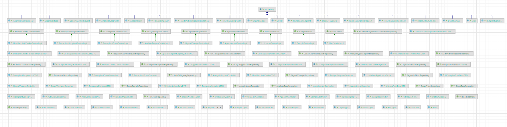

Na imagem seguinte estão os diretórios de LabdsoftCore:

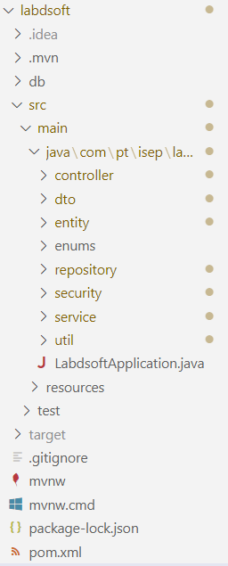

Na imagem seguinte estão os diretórios de LabdsoftUI:

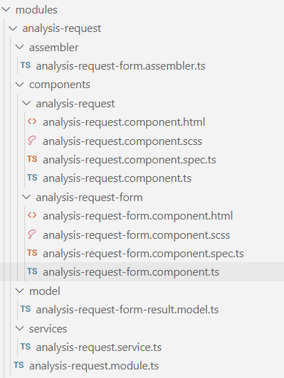

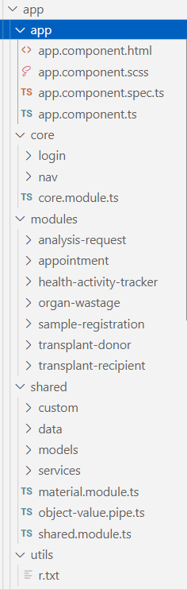

### Requisitos

Neste subcapítulo serão apresentados os diagramas de sequência dos requisitos e uma breve análise de cada. Uma vez que alguns requisitos são muito parecidos entre si, foram desenhados diagramas genéricos.

Para esta iteração o product owner sugeriu os seguintes requisitos:

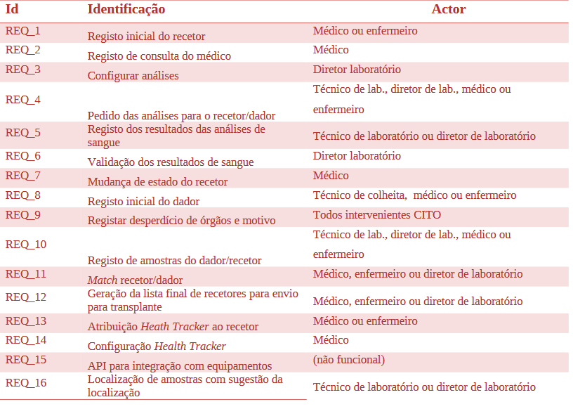

Para além destes requisitos o grupo implementou a autenticação e a autorização da aplicação, que é o REQ_17

#### CREATE

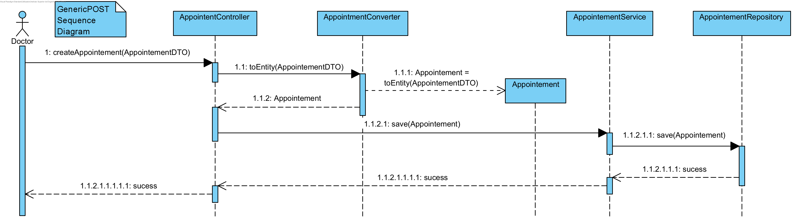

#### READ

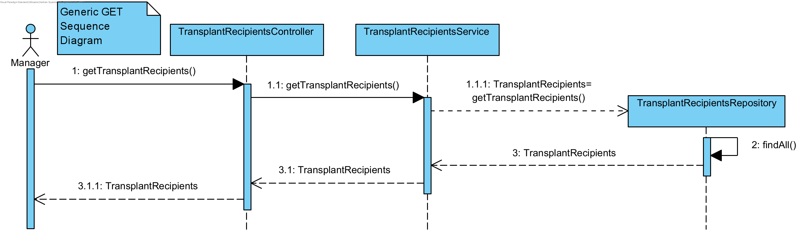

#### UPDATE

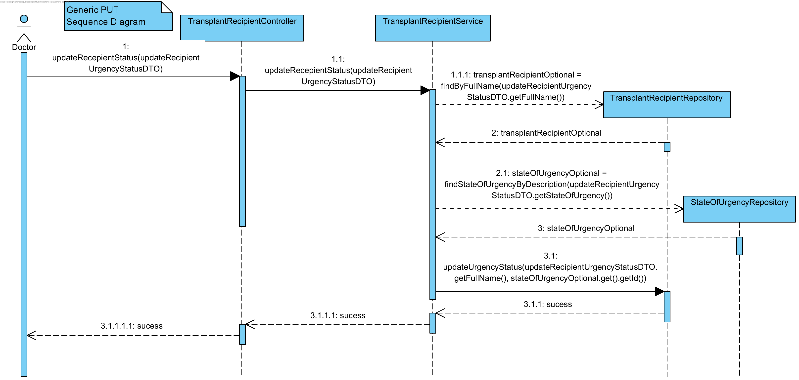

Os 3 diagramas atrás representados são as bases de todos os REQ's que estão na tabela.

O Diagrama de Create é utilizado principalmente pelo REQ_1, REQ_2, REQ_5, REQ_8, REQ_9, REQ_10.

O Diagrama de Read é utilizado pelo REQ_3, REQ_6, REQ_7, REQ_12, REQ_14, REQ_16.

O Diagrama de Update é utilizado pelo REQ_6, REQ_7, REQ13, REQ_14.

### REQ_15

Para cumprir este requisito foi necessário criar uma outra REST API que gera os resultados das análises.

Na imagem seguinte encontra-se a estrutura da aplicação:

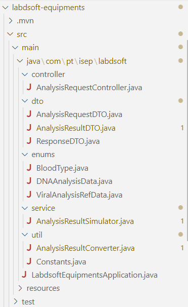

Esta API recebe pedidos da aplicação Core principal e vai gerar os resultados das análises conforme o pedido de análises recebido, retornando os valores para cada análise requerida.

Primeiramente recebe um pedido Post com o tipo de análises a serem feitas assim como a respetiva amostra e paciente. De seguida, é invocado o algoritmo desenvolvido que através dos dados fornecidos gera os resultados das análises com base nas configurações estipuladas. As configurações estipuladas são as seguintes:

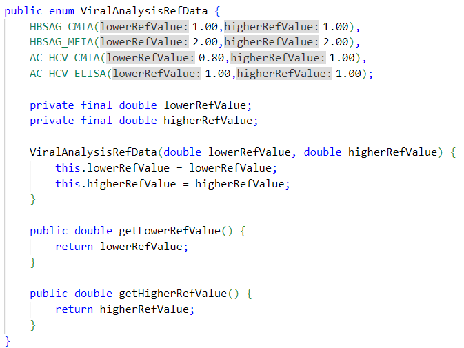

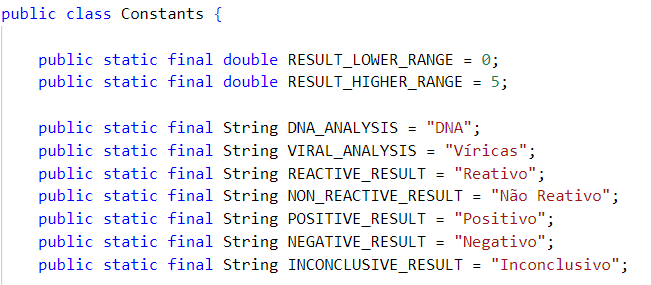

Após os resultados serem gerados, estes são retornados para a aplicação principal, responsável por persisti-los na base de dados.

A comunicação entre estes dois componentes é feita através de um cliente REST Template. Os restantes passos vão de encontro ao diagrama Create supra mencionado.

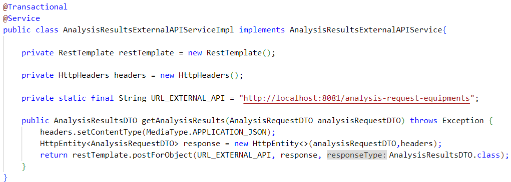

### REQ_17

Para cumprir este requisito foi utilizado o método padrão de segurança JWT de modo a realizar a autenticação e a autorização.

Quando um novo utilizador é registado na plataforma, a sua palavra-passe antes de ser persistida na base de dados é criptografada e ao utilizador fica associado um token de sessão. Todos os pedidos efetuados ao Core da aplicação através da UI necessitam desse token para efetuar com sucesso a comunicação. Para esse efeito é realizado o login e armazenado em local storage esse token.

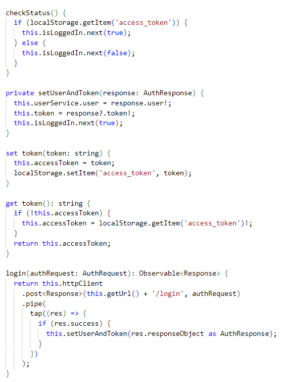

A aplicação verifica o estado do token para permitir atualizar os HTTPHeaders de modo a garantir o sucesso dos pedidos.

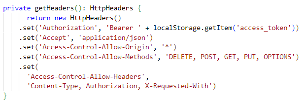

Foi também aplicado autorização para restringir o acesso às funcionalidades 

Desta forma quando um utilizador é criado é-lhe atribuído um role e consoante esse role vai-lhe ser permitido ter acesso a certas partes da plataforma.

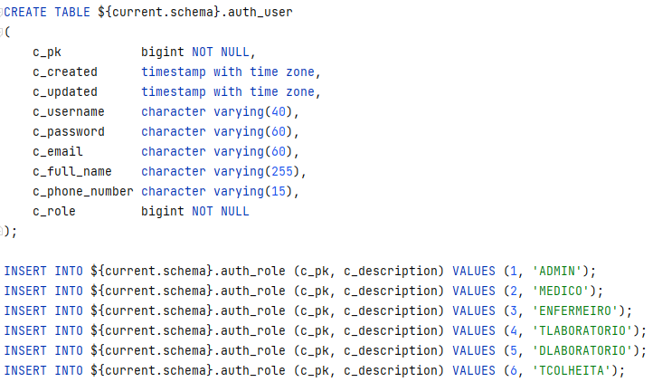

Nas imagens seguintes é possível verificar que os utilizadores que tem o role "TCOLHEITA" não tem acesso à aba de registar amostra ou apenas aqueles que possuem o role "MEDICO" ou "ADMIN" tem acesso ao registo de consultas.

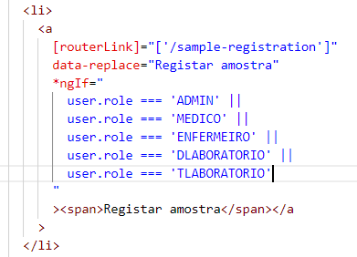

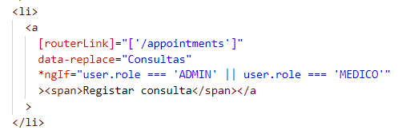

###  **Pipeline**

Para a atual iteração de desenvolvimento, a implementação de pipelines no projeto passa por um **trigger** de uma Bitbucket Pipeline quando alterações são **committed** na **dev**, onde a correta compilação do código dos componentes de aplicação, interface gráfica e de equipamentos é verificada, assim como o scan de segurança, sendo a execução bem sucedida se nenhum componente falhar.

Step da API LabdsoftCore

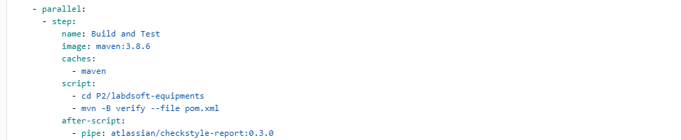

Step da API Equipment

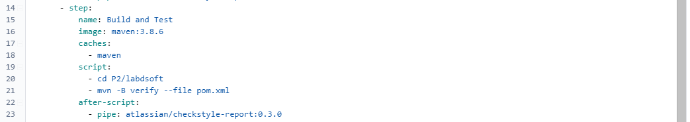

Step da API LabdsoftUI

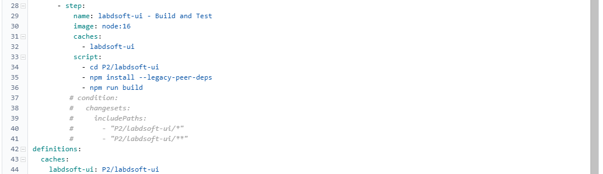

Step do Scan de Segurança

A equipa discutiu também a possível implementação de **triggered scheduling** e mesmo verificações de critérios adicionais para um melhor entendimento do comportamento e desempenho atual, mas dados constrangimentos de tempo optou por não realizar. No entanto, é algo que pode vir a ser adicionado em futuras iterações.
